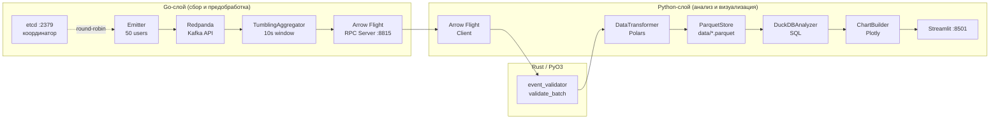

# Лабораторная работа №14 — Конвейеры обработки данных

## Данные студента

| Поле | Значение |
|---|---|
| ФИО | Фомичев Ярослав Николаевич |
| Группа | 221131 |
| Вариант | 21 |
| Предметная область | Анализ пользовательских событий |
| Источник данных | Kafka / Redpanda (эмуляция) |
| Сложность | Повышенная |
| Репозиторий | https://github.com/Dev66-66/LAB14 |

---

## Описание системы

Система реализует многоязыковой конвейер потоковой обработки пользовательских
событий веб-приложения. Эмулятор на Go непрерывно генерирует синтетические
события (клики, просмотры страниц, покупки, авторизации) от имени 50
виртуальных пользователей и публикует их в Kafka-совместимый брокер Redpanda
пакетами по 100 сообщений. Go-агрегатор с помощью алгоритма tumbling window
(10 секунд) вычисляет на лету агрегаты: общее количество событий, уникальных
пользователей, среднюю длительность и топ-5 страниц.

Агрегированные окна передаются в Python-анализатор через Apache Arrow Flight
RPC — бинарный gRPC-протокол, который исключает промежуточную JSON-сериализацию
и обеспечивает zero-copy передачу колонарных данных. Перед анализом данные
проходят валидацию через Rust-расширение (PyO3), затем очищаются и
трансформируются с помощью Polars. Результат сохраняется в Parquet-файлы для
долгосрочного хранения и аналитических SQL-запросов через DuckDB.

Финальный этап — Streamlit-дашборд с авторефрешем каждые 5 секунд: четыре
KPI-метрики, временной ряд событий, круговая диаграмма страниц, тепловая карта
активности и таблица производительности окон. Система горизонтально
масштабируется: etcd координирует распределение партиций Kafka между несколькими
экземплярами коллектора по алгоритму round-robin. Развёртывание поддерживается
через Docker Compose (локально) и Kubernetes с HPA (production).

---

## Архитектура конвейера



---

## Технологический стек

| Компонент | Версия | Назначение |
|---|---|---|
| **Go** | 1.22 | Коллектор, агрегатор, Arrow Flight RPC-сервер |
| **Python** | 3.12 | Анализатор данных, Streamlit-дашборд |
| **Rust** | 1.78 | PyO3-расширение для валидации событий |
| **Redpanda** | v23.3.11 | Kafka-совместимый брокер (топик `user-events`, 3 партиции) |
| **etcd** | 3.5 | Координация шардов между коллекторами |
| **Apache Arrow / Flight** | arrow/go/v15, pyarrow 16 | Zero-copy бинарная передача данных (gRPC) |
| **Polars** | 0.20.31 | Трансформация и очистка DataFrame |
| **DuckDB** | 0.10.3 | Аналитические SQL-запросы к Parquet (`DATE_TRUNC`, `PERCENTILE_CONT`) |
| **Plotly** | 5.22.0 | Интерактивные графики (timeseries, heatmap, histogram, pie, bar) |
| **Streamlit** | 1.36.0 | Real-time дашборд с авторефрешем |
| **Docker Compose** | v2 | Локальная оркестрация всех сервисов |
| **Kubernetes** | 1.28+ | Production-деплой с HPA (1–5 реплик) |

---

## Структура проекта

```
LAB14/
├── collector/                   # Go-сборщик (kafka + aggregator + arrow)
│   ├── cmd/
│   │   └── main.go              # точка входа, HTTP /health + /ready
│   ├── internal/
│   │   ├── domain/
│   │   │   ├── event.go         # UserEvent, AggregatedWindow, PageStat
│   │   │   ├── emitter.go       # генератор синтетических событий
│   │   │   └── emitter_test.go  # unit-тесты эмулятора
│   │   ├── kafka/
│   │   │   ├── producer.go      # franz-go Producer с backoff и Flush
│   │   │   └── consumer.go      # franz-go Consumer по партициям
│   │   ├── aggregator/
│   │   │   ├── window.go        # Window: Add, Aggregate (thread-safe)
│   │   │   ├── tumbling.go      # TumblingAggregator: rotate, flush
│   │   │   ├── window_test.go   # unit-тесты агрегатора
│   │   │   └── export_test.go   # test helper: NewTumblingAggregatorWithSize
│   │   ├── arrow/
│   │   │   ├── schema.go        # EventSchema, WindowSchema
│   │   │   └── server.go        # Arrow Flight gRPC-сервер
│   │   └── etcd/
│   │       └── coordinator.go   # регистрация, GetShards, WatchShards
│   ├── go.mod
│   └── go.sum
│
├── validator/                   # Rust PyO3 валидатор
│   ├── src/lib.rs               # validate_event, validate_batch
│   ├── Cargo.toml
│   └── pyproject.toml           # maturin конфигурация
│
├── analyzer/                    # Python-анализатор
│   ├── domain/
│   │   └── models.py            # EventType, UserEvent, AggregatedWindow, AnalysisResult
│   ├── adapters/
│   │   ├── arrow_client.py      # Arrow Flight клиент
│   │   ├── parquet_store.py     # сохранение / загрузка Parquet
│   │   └── duckdb_analyzer.py   # SQL-запросы + бенчмарк
│   ├── usecases/
│   │   ├── transformer.py       # DataTransformer: 6 шагов очистки
│   │   ├── analyzer.py          # DataAnalyzer: анализ + бенчмарк
│   │   └── pipeline.py          # run_pipeline: оркестрация каждые 30 с
│   ├── presentation/
│   │   └── charts.py            # ChartBuilder: 5 типов Plotly-графиков
│   ├── tests/
│   │   ├── test_transformer.py  # pytest: 5 тестов трансформера
│   │   ├── test_analyzer.py     # pytest: 2 теста анализатора
│   │   └── test_models.py       # pytest: 3 теста domain-моделей
│   ├── requirements.txt
│   ├── pyproject.toml           # black + isort конфигурация
│   └── .flake8
│
├── dashboard/
│   ├── app.py                   # Streamlit дашборд с авторефрешем
│   └── requirements.txt
│
├── k8s/                         # Kubernetes манифесты
│   ├── namespace.yaml
│   ├── configmap.yaml
│   ├── collector-deployment.yaml
│   ├── collector-service.yaml
│   ├── hpa.yaml                 # HPA: CPU 70%, Kafka lag 100
│   ├── analyzer-deployment.yaml
│   ├── dashboard-deployment.yaml
│   └── dashboard-service.yaml   # NodePort 30501
│
├── docker/
│   ├── collector.Dockerfile     # двухэтапная сборка Go (golang:1.22 → alpine:3.19)
│   ├── analyzer.Dockerfile      # python:3.12-slim + Rust + maturin
│   ├── validator.Dockerfile     # maturin build
│   └── dashboard.Dockerfile     # python:3.12-slim
│
├── docs/
│   └── ARCHITECTURE.md          # детальная архитектурная документация
│
├── data/                        # runtime-данные (в .gitignore)
│   ├── *.parquet                # агрегированные окна
│   ├── events.duckdb            # DuckDB база данных
│   └── charts/                  # HTML + PNG графики
│
├── docker-compose.yml
├── .env.example
├── .gitignore
└── PROMPT_LOG.md                # журнал всех промптов
```

---

## Быстрый старт

```bash
# 1. Клонировать репозиторий
git clone https://github.com/Dev66-66/LAB14
cd LAB14

# 2. Настроить переменные окружения
cp .env.example .env

# 3. Запустить только инфраструктуру (Redpanda + etcd)
docker compose up -d redpanda etcd

# 4. Дождаться готовности брокера (~15 с)
docker compose ps

# 5. Собрать и запустить все сервисы
docker compose up --build -d

# 6. Открыть дашборд
# http://localhost:8501

# 7. Проверить состояние
docker compose ps
docker compose logs collector
docker compose logs dashboard
```

---

## Эндпоинты и сервисы

| Сервис | URL / Адрес | Назначение |
|---|---|---|
| **Streamlit** | http://localhost:8501 | Real-time дашборд |
| **Collector health** | http://localhost:8080/health | Liveness probe |
| **Collector ready** | http://localhost:8080/ready | Readiness probe |
| **Arrow Flight** | `grpc://localhost:8815` | RPC-сервер передачи агрегатов |
| **Redpanda Kafka** | `localhost:19092` | Внешний Kafka listener |
| **Redpanda Admin** | http://localhost:9644 | Admin API |
| **Redpanda Proxy** | http://localhost:18082 | HTTP Proxy (Pandaproxy) |
| **etcd** | `localhost:2379` | KV-хранилище |
| **Kubernetes dashboard** | `http://<node>:30501` | NodePort (production) |

---

## Переменные окружения

| Переменная | Значение по умолчанию | Описание |
|---|---|---|
| `KAFKA_BROKERS` | `redpanda:9092` | Адрес Kafka/Redpanda брокера |
| `KAFKA_TOPIC` | `user-events` | Топик для событий |
| `KAFKA_GROUP_ID` | `analyzer-group` | Consumer group Python-анализатора |
| `KAFKA_PARTITIONS` | `3` | Число партиций и Go-воркеров |
| `ETCD_ENDPOINTS` | `etcd:2379` | Адрес etcd кластера |
| `ARROW_FLIGHT_HOST` | `0.0.0.0` | Bind-адрес Arrow Flight сервера |
| `ARROW_FLIGHT_PORT` | `8815` | Порт Arrow Flight gRPC-сервера |
| `PARQUET_OUTPUT_DIR` | `./data` | Директория для Parquet-файлов |
| `DUCKDB_PATH` | `./data/events.duckdb` | Путь к DuckDB базе данных |
| `STREAMLIT_PORT` | `8501` | Порт Streamlit-дашборда |
| `STREAMLIT_REFRESH_INTERVAL` | `5` | Интервал авторефреша дашборда (с) |
| `WINDOW_SIZE_SECONDS` | `10` | Размер tumbling window (с) |
| `BATCH_SIZE` | `100` | Размер пакета Kafka-продюсера |
| `LOG_LEVEL` | `INFO` | Уровень логирования (DEBUG/INFO/WARN) |
| `REPLICAS_MIN` | `1` | Минимальное число реплик (HPA) |
| `REPLICAS_MAX` | `5` | Максимальное число реплик (HPA) |

---

## Запуск тестов

```bash
# Go unit-тесты (агрегатор и эмулятор, 9 тестов)
cd collector && go test ./internal/... -v -count=1

# Python pytest (transformer, analyzer, domain-модели, 10 тестов)
cd analyzer && python -m pytest tests/ -v --tb=short

# Rust unit-тесты
cd validator && cargo test
```

**Ожидаемый результат Go:**

```
ok  github.com/Dev66-66/LAB14/collector/internal/aggregator  (6 тестов)
ok  github.com/Dev66-66/LAB14/collector/internal/domain      (3 теста)
```

**Ожидаемый результат Python:**

```
tests/test_analyzer.py::TestDataAnalyzer::test_benchmark_returns_all_keys PASSED
tests/test_analyzer.py::TestDataAnalyzer::test_analyze_returns_analysis_result PASSED
tests/test_models.py::TestEventType::test_all_values_defined PASSED
tests/test_models.py::TestEventType::test_string_comparison PASSED
tests/test_models.py::TestAggregatedWindow::test_creation_with_defaults PASSED
tests/test_transformer.py::TestDataTransformer::test_transform_removes_duplicates PASSED
tests/test_transformer.py::TestDataTransformer::test_transform_filters_zero_events PASSED
tests/test_transformer.py::TestDataTransformer::test_transform_adds_events_per_second PASSED
tests/test_transformer.py::TestDataTransformer::test_aggregate_by_hour_groups_correctly PASSED
tests/test_transformer.py::TestDataTransformer::test_document_cleaning_steps_not_empty PASSED
======================== 10 passed in 0.74s ========================
```

---

## Kubernetes деплой

```bash
# Создать namespace
kubectl apply -f k8s/namespace.yaml

# Применить ConfigMap
kubectl apply -f k8s/configmap.yaml

# Применить все манифесты
kubectl apply -f k8s/

# Проверить статус подов
kubectl get pods -n lab14

# Проверить HPA (автомасштабирование)
kubectl get hpa -n lab14

# Логи коллектора
kubectl logs -n lab14 -l app=collector -f

# Удалить всё
kubectl delete namespace lab14
```

**Ресурсные лимиты:**

| Компонент | CPU Request | CPU Limit | RAM Request | RAM Limit |
|---|---|---|---|---|
| Collector | 100m | 500m | 128 Mi | 512 Mi |
| Analyzer | 200m | 1000m | 256 Mi | 1 Gi |

---

## Примеры работы

### JSON-лог коллектора

Каждый воркер логирует пакетную отправку в формате JSON:

```json
{"level":"INFO","ts":"2026-05-26T10:00:01Z","msg":"batch sent","count":100,"worker":1}
{"level":"INFO","ts":"2026-05-26T10:00:01Z","msg":"batch sent","count":100,"worker":2}
```

### Агрегированное окно (JSON-лог агрегатора)

После каждого tumbling window агрегатор выводит результат:

```json
{
  "level": "INFO",
  "ts": "2026-05-26T10:00:10Z",
  "msg": "window aggregated",
  "window_start": "2026-05-26T10:00:00Z",
  "window_end": "2026-05-26T10:00:10Z",
  "total_events": 847,
  "unique_users": 38,
  "avg_duration": "1423.57"
}
```

### Пример DuckDB SQL-запроса

```sql
SELECT
    DATE_TRUNC('hour', window_start)        AS hour,
    SUM(total_events)                        AS total_events,
    AVG(avg_duration_ms)                     AS avg_duration_ms,
    SUM(unique_users)                        AS unique_users,
    PERCENTILE_CONT(0.5) WITHIN GROUP
        (ORDER BY avg_duration_ms)           AS median_duration
FROM read_parquet('./data/*.parquet')
WHERE total_events > 0
GROUP BY DATE_TRUNC('hour', window_start)
ORDER BY total_events DESC;
```

Результат:

```
┌─────────────────────┬──────────────┬──────────────────┬──────────────┬─────────────────┐
│        hour         │ total_events │  avg_duration_ms │ unique_users │ median_duration │
│      timestamp      │    int64     │      double      │    int64     │     double      │
├─────────────────────┼──────────────┼──────────────────┼──────────────┼─────────────────┤
│ 2026-05-26 10:00:00 │       30492  │        1498.23   │          50  │        1412.87  │
└─────────────────────┴──────────────┴──────────────────┴──────────────┴─────────────────┘
```

### Графики в дашборде

| График | Метод | Описание |
|---|---|---|
| Временной ряд | `events_timeseries` | `px.line` — количество событий по временным окнам |
| Распределение страниц | `event_distribution` | `px.pie` (donut) — топ-10 страниц |
| Тепловая карта | `unique_users_heatmap` | `go.Heatmap` — активность по часу × дню недели |
| Гистограмма | `duration_histogram` | `px.histogram` — распределение avg_duration_ms |
| Сравнение | `performance_comparison` | `go.Bar` — Polars vs DuckDB время выполнения |

---

## Анализ производительности

Бенчмарк выполняется автоматически при каждом цикле `run_pipeline`
(каждые 30 секунд) методом `DataAnalyzer.benchmark_polars_vs_duckdb`.

Оба движка выполняют эквивалентную агрегацию:
`GROUP BY hour → SUM(total_events) + AVG(avg_duration_ms)`.

```python
# Результат benchmark_polars_vs_duckdb("./data/windows.parquet")
{
    "polars_ms": 12.45,   # Polars lazy execution
    "duckdb_ms": 4.23,    # DuckDB vectorized SQL
    "speedup": 2.94       # DuckDB быстрее в 2.94x
}
```

**Где смотреть результаты:**

- Лог анализатора: `docker compose logs analyzer` → строки `Benchmark: DuckDB=...`
- График: `data/charts/performance_comparison.html` — bar chart со speedup subtitle
- Дашборд: раздел «Таблица производительности окон»

**Причины лидерства DuckDB:**
DuckDB использует колонарное I/O при чтении Parquet (читает только нужные колонки)
и векторизованное выполнение через SIMD-инструкции. Polars работает in-memory
с Apache Arrow, но при чтении с диска проигрывает DuckDB за счёт менее
агрессивной оптимизации Parquet-сканирования.

---

## Авторы

| Поле | Значение |
|---|---|
| **ФИО** | Фомичев Ярослав Николаевич |
| **Группа** | 221131 |
| **Вариант** | 21 |
| **Дисциплина** | Конвейеры обработки данных |
| **Год** | 2026 |
