# Архитектура конвейера обработки пользовательских событий

**Лабораторная работа №14 · Вариант 21 · Фомичев Ярослав Николаевич · Группа 221131**

---

## 1. Обзор системы

Система реализует многоязыковой конвейер потоковой обработки пользовательских
событий веб-приложения. Данные генерируются эмулятором, проходят через
Kafka-совместимый брокер Redpanda, предобрабатываются в памяти Go-агрегатором
с помощью скользящих временных окон, передаются в Python-слой через Apache Arrow
Flight RPC, очищаются и анализируются с помощью Polars и DuckDB, после чего
визуализируются в Streamlit-дашборде.

**Ключевые характеристики:**

- Три языка реализации: Go (сбор), Rust (валидация), Python (анализ)
- Потоковая обработка: tumbling window 10 с, буферизация через Kafka
- Бинарный транспорт данных: Apache Arrow Flight вместо JSON/HTTP
- Колонарное хранилище: Parquet-файлы для аналитических запросов
- Горизонтальное масштабирование: etcd-координация шардов Kafka между
  несколькими экземплярами коллектора

---

## 2. Архитектурная диаграмма (Mermaid)

```mermaid
flowchart LR
    subgraph Go["Go-слой (сбор и предобработка)"]
        E[Emitter\nэмулятор событий] --> K[Redpanda\nKafka API]
        K --> A[TumblingAggregator\n10s window]
        A --> F[Arrow Flight\nRPC Server]
        ET[etcd\nкоординатор] -.координация шардов.-> E
    end

    subgraph Python["Python-слой (анализ и визуализация)"]
        AC[Arrow Flight\nClient] --> V[event_validator\nRust/PyO3]
        V --> T[DataTransformer\nPolars]
        T --> P[ParquetStore\nParquet файлы]
        P --> D[DuckDBAnalyzer\nSQL запросы]
        D --> C[ChartBuilder\nPlotly]
        C --> S[Streamlit\nДашборд]
    end

    F --> AC
```



---

## 3. Описание компонентов

| Компонент | Язык | Назначение | Файл / Пакет |
|---|---|---|---|
| **Emitter** | Go | Генерирует синтетические UserEvent (50 польз., 20 сессий, 8 страниц) | `collector/internal/domain/emitter.go` |
| **Kafka Producer** | Go | Пакетная отправка событий в Redpanda с экспоненциальным backoff | `collector/internal/kafka/producer.go` |
| **Kafka Consumer** | Go | Чтение событий из партиций, передача в агрегатор | `collector/internal/kafka/consumer.go` |
| **TumblingAggregator** | Go | Tumbling window 10 с: TotalEvents, UniqueUsers, AvgDuration, TopPages | `collector/internal/aggregator/` |
| **Arrow Flight Server** | Go | gRPC-сервер; сериализует AggregatedWindow в RecordBatch | `collector/internal/arrow/server.go` |
| **etcd Coordinator** | Go | Регистрация коллекторов, round-robin распределение партиций | `collector/internal/etcd/coordinator.go` |
| **event_validator** | Rust | PyO3-расширение: 6 правил валидации, пакетная обработка | `validator/src/lib.rs` |
| **Arrow Flight Client** | Python | Получение AggregatedWindow от Go-сервера по gRPC | `analyzer/adapters/arrow_client.py` |
| **DataTransformer** | Python | Очистка данных (Polars): дубликаты, нулевые окна, новые колонки | `analyzer/usecases/transformer.py` |
| **ParquetStore** | Python | Сохранение / загрузка окон в Parquet через Polars | `analyzer/adapters/parquet_store.py` |
| **DuckDBAnalyzer** | Python | SQL-запросы к Parquet: DATE_TRUNC, PERCENTILE_CONT, бенчмарк | `analyzer/adapters/duckdb_analyzer.py` |
| **ChartBuilder** | Python | Plotly-графики: timeseries, heatmap, histogram, pie, bar | `analyzer/presentation/charts.py` |
| **Streamlit Dashboard** | Python | Real-time дашборд с авторефрешем каждые 5 с | `dashboard/app.py` |
| **Redpanda** | Infra | Kafka-совместимый брокер, топик `user-events` (3 партиции) | `docker-compose.yml` |
| **etcd** | Infra | Распределённое KV-хранилище для координации коллекторов | `docker-compose.yml` |

---

## 4. Слоистая архитектура

Проект следует принципу **Clean Architecture** — зависимости направлены
только внутрь (от presentation к domain).

```
┌────────────────────────────────────────────────────┐
│  presentation/   Plotly-графики, Streamlit-дашборд │
├────────────────────────────────────────────────────┤
│  usecases/       DataTransformer, DataAnalyzer,    │
│                  run_pipeline                       │
├────────────────────────────────────────────────────┤
│  adapters/       ArrowFlightClient, ParquetStore,  │
│                  DuckDBAnalyzer                     │
├────────────────────────────────────────────────────┤
│  domain/         UserEvent, AggregatedWindow,      │
│                  EventType, PageStat, AnalysisResult│
└────────────────────────────────────────────────────┘
```

| Слой | Содержимое | Внешние зависимости |
|---|---|---|
| **domain/** | Чистые датаклассы и перечисления, нет бизнес-логики | — |
| **adapters/** | Интеграция с Arrow Flight, Parquet, DuckDB | pyarrow, polars, duckdb |
| **usecases/** | Трансформации, агрегации, оркестрация пайплайна | domain, adapters |
| **presentation/** | Построение графиков и дашборда | plotly, streamlit |

---

## 5. Поток данных (Data Flow)

```
1. Emitter (Go)
   └─ генерирует UserEvent{ID, UserID, SessionID, EventType, Page,
      Duration, Metadata, Timestamp} каждые ~100 мс

2. Kafka Producer (Go, franz-go)
   └─ пакетная отправка (BATCH_SIZE=100) в топик user-events
      ключ = UserID → детерминированное партиционирование

3. Redpanda (Kafka-совместимый брокер)
   └─ хранение: 3 партиции, retention 1 ч

4. etcd Coordinator (Go)
   └─ каждый коллектор регистрируется в /collectors/{id}
      получает назначенные партиции по round-robin

5. Kafka Consumer (Go)
   └─ читает события из назначенных партиций
      передаёт в TumblingAggregator

6. TumblingAggregator (Go)
   └─ каждые 10 с: вычисляет TotalEvents, UniqueUsers,
      AvgDuration, EventCounts, TopPages
      публикует AggregatedWindow в выходной канал

7. Arrow Flight Server (Go, arrow/go/v15)
   └─ буферизует окна, сериализует в Apache Arrow RecordBatch
      отдаёт Python-клиенту по gRPC без промежуточной JSON-сериализации

8. Arrow Flight Client (Python, pyarrow.flight)
   └─ получает RecordBatch, конвертирует в List[AggregatedWindow]

9. event_validator (Rust/PyO3)
   └─ валидирует каждое окно: 6 правил (UUID, EventType,
      Duration ≥ 0, Page, UserID, Timestamp)

10. DataTransformer (Python, Polars)
    └─ очистка: удаление дубликатов, фильтрация total_events=0,
       приведение типов, window_duration_sec, events_per_second

11. ParquetStore (Python, Polars)
    └─ сохраняет DataFrame в data/windows_{timestamp}.parquet

12. DuckDBAnalyzer (Python, DuckDB)
    └─ SQL-запросы к Parquet: DATE_TRUNC по часам, PERCENTILE_CONT
       бенчмарк Polars vs DuckDB

13. ChartBuilder (Python, Plotly)
    └─ 5 типов графиков → HTML + PNG в data/charts/

14. Streamlit Dashboard
    └─ читает Parquet каждые 5 с, отображает KPI, графики, таблицу
```

---

## 6. Kafka топики

| Топик | Партиции | Retention | Producer | Consumer |
|---|---|---|---|---|
| `user-events` | 3 | 1 ч (3 600 000 мс) | Go Emitter (ключ = UserID) | Go Collector (по назначенным партициям) |

**Конфигурация брокера (Redpanda):**

| Параметр | Значение |
|---|---|
| Образ | `redpandadata/redpanda:v23.3.11` |
| Режим | `dev-container` |
| Listeners | internal `9092`, external `19092` |
| Schema Registry | `8081` / `18081` |
| HTTP Proxy | `8082` / `18082` |
| Память | 1 GB |
| Admin API | `9644` |

---

## 7. Формат данных на каждом этапе

| Этап | Формат | Схема (основные поля) |
|---|---|---|
| **Emitter → Kafka** | JSON (UTF-8) | `{id, user_id, session_id, event_type, page, duration_ms, metadata, timestamp}` |
| **Kafka → Aggregator** | Go struct `UserEvent` | `ID string, UserID string, EventType, Page, Duration float64, Timestamp time.Time` |
| **Aggregator → Flight Server** | Go struct `AggregatedWindow` | `WindowStart, WindowEnd time.Time, TotalEvents int64, EventCounts map[EventType]int64, UniqueUsers int64, AvgDuration float64, TopPages []PageStat` |
| **Flight Server → Client** | Apache Arrow RecordBatch | `window_start TIMESTAMP[us,UTC], window_end TIMESTAMP[us,UTC], total_events INT64, unique_users INT64, avg_duration_ms FLOAT64` |
| **Client → Transformer** | Python `List[AggregatedWindow]` | Датакласс с теми же полями |
| **Transformer → Parquet** | Polars DataFrame → Parquet | `window_start Datetime[ms,UTC], window_end Datetime[ms,UTC], total_events Int64, unique_users Int64, avg_duration_ms Float64, top_pages Utf8 (JSON), window_duration_sec Float64, events_per_second Float64` |
| **Parquet → DuckDB** | Apache Parquet (колонарный) | Читается через `read_parquet(path)` |
| **DuckDB → Charts** | Pandas DataFrame | Результат SQL-агрегации |

---

## 8. Tumbling Window

**Алгоритм:**

Каждые `WINDOW_SIZE_SECONDS` (дефолт: 10 с) агрегатор атомарно меняет
текущее окно на новое и публикует результат старого.

```
rotate():
  new_window = NewWindow(now, windowSize)
  old = swap(current, new_window)   # atomic under mutex
  agg = old.Aggregate()
  publish(agg)
```

**Агрегируемые поля:**

| Поле | Формула |
|---|---|
| `TotalEvents` | `len(events)` |
| `UniqueUsers` | `len(distinct UserID)` |
| `AvgDuration` | `sum(Duration) / len(events)` |
| `EventCounts` | `map[EventType]count` |
| `TopPages` | Топ-5 страниц по убыванию count; при равных — лексикографически |

**Вычисляемые поля (Polars, после получения):**

```
window_duration_sec = (window_end.cast(Int64) - window_start.cast(Int64)) / 1_000
events_per_second   = total_events / window_duration_sec   (0 при duration=0)
```

**Поведение при завершении:**

При получении сигнала остановки агрегатор вызывает `flush()` —
публикует остаток текущего окна, если в нём есть события (`TotalEvents > 0`).

---

## 9. etcd координация

**Цель:** детерминированное распределение партиций Kafka между несколькими
экземплярами коллектора без центрального планировщика.

**Регистрация:**

```
ключ:   /collectors/{collectorID}
значение: {"id":"...", "registered_at":"...", "status":"active"}
lease TTL: 30 с (автообновление keepalive-горутиной)
```

**Алгоритм распределения (GetShards):**

```
1. Получить все ключи /collectors/* из etcd
2. Отсортировать ID коллекторов лексикографически
3. Найти позицию текущего коллектора: idx = sort.SearchStrings(ids, selfID)
4. Назначить партиции: partition p → коллектор с idx = p % len(collectors)
   (round-robin через остаток от деления)
```

**Реакция на изменения:**

`WatchShards` подписывается на префикс `/collectors/` через etcd Watch API.
При любом событии (PUT / DELETE) небуферизованный канал уведомляет
коллектор, который вызывает `GetShards()` повторно и переназначает партиции.
Канал буферизован на 1 элемент — пропускает дубли при частых изменениях.

**Graceful shutdown:**

`Deregister()` явно удаляет ключ и отзывает lease — соседние коллекторы
мгновенно получают уведомление и перераспределяют партиции.

---

## 10. Производительность

Таблица заполняется при реальном запуске конвейера (`run_pipeline`).
Бенчмарк выполняется автоматически: `DataAnalyzer.benchmark_polars_vs_duckdb`.

| Инструмент | Операция | Время (мс) | Примечания |
|---|---|---|---|
| **DuckDB** | GROUP BY час + SUM + AVG на Parquet | _заполняется при запуске_ | Колонарное чтение, векторизация |
| **Polars** | Эквивалентная агрегация (lazy) | _заполняется при запуске_ | In-process, Apache Arrow внутри |
| **Arrow Flight** | Передача батча окон (gRPC) | _заполняется при запуске_ | Zero-copy, бинарный протокол |
| **Rust validator** | validate_batch(1000 событий) | _заполняется при запуске_ | Нативный код через PyO3 |

**Ожидаемый результат:** DuckDB быстрее Polars на аналитических запросах
к Parquet (колонарное I/O vs in-memory scan). Разрыв зависит от размера файла
и количества групп.

---

## 11. Развёртывание

### Docker Compose (локальная разработка)

```bash
# Запуск инфраструктуры и всех сервисов
docker compose up -d

# Только инфраструктура (Redpanda + etcd)
docker compose up -d redpanda etcd

# Просмотр логов коллектора
docker compose logs -f collector

# Остановка
docker compose down -v
```

**Сервисы и порты:**

| Сервис | Порт (хост) | Описание |
|---|---|---|
| `redpanda` | `19092` (Kafka), `18082` (HTTP Proxy), `9644` (Admin) | Kafka-брокер |
| `etcd` | `2379` | KV-хранилище |
| `collector` | `8080` (`/health`, `/ready`) | Go-коллектор |
| `dashboard` | `8501` | Streamlit-дашборд |

**Endpoints коллектора:**

| Endpoint | Метод | Описание |
|---|---|---|
| `/health` | GET | Liveness probe — всегда 200 OK |
| `/ready` | GET | Readiness probe — 200 когда Kafka и etcd подключены |

### Kubernetes (production)

```bash
# Применить все манифесты
kubectl apply -f k8s/

# Проверить статус
kubectl get pods -n lab14
kubectl get hpa -n lab14

# Просмотр логов
kubectl logs -n lab14 -l app=collector -f

# Доступ к дашборду (NodePort 30501)
http://<node-ip>:30501
```

**Манифесты (`k8s/`):**

| Файл | Ресурс | Описание |
|---|---|---|
| `namespace.yaml` | Namespace `lab14` | Изоляция ресурсов |
| `configmap.yaml` | ConfigMap `lab14-config` | Переменные окружения |
| `collector-deployment.yaml` | Deployment (2 реплики) | Go-коллектор |
| `collector-service.yaml` | Service ClusterIP `:8080` | Внутренний доступ |
| `hpa.yaml` | HPA (1–5 реплик) | Автомасштабирование по CPU (70%) и Kafka lag (100) |
| `analyzer-deployment.yaml` | Deployment (1 реплика) | Python-анализатор |
| `dashboard-deployment.yaml` | Deployment (1 реплика) | Streamlit-дашборд |
| `dashboard-service.yaml` | Service NodePort `30501` | Внешний доступ |
